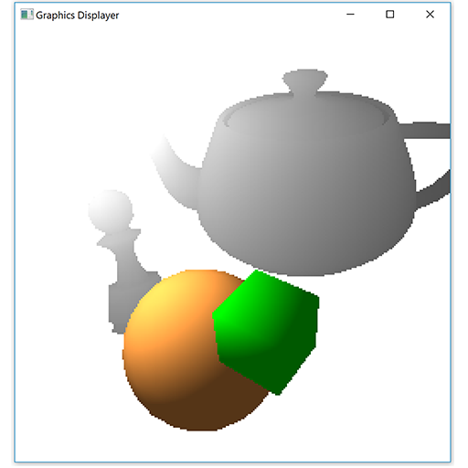

# graphics-displayer

Simulation of a graphics pipeline implemented in Scala.

This is something I started as a self learning project and for fun. The
project implements basic concepts of a graphics pipeline in software,
starting from specification of 3D geometric models, to creating "virtual
pixels" that can be drawn to a window, displaying those models. This
program uses [ScalaFX](https://github.com/scalafx/scalafx) for
displaying graphical elements in a window. The virtual pixels are
represented by ScalaFX rectangles. That, of course, is not very
efficient or useful for any real world purpose, but it was fun to write :)

|  |
|:--:|
| *The objects in this picture are constructed of small ScalaFX rectangles* |

**The basic pipeline implemented:**

- Specification of 3D models (in a manner similar to OpenGL vertex
arrays, and with various draw modes)
- Model/view/projection transformation
- Primitive assembly
- Viewport clipping (to arbitrary convex shapes)
- Rasterization
- Basic pixel shading (color and lighting)

There is also a more simplified and efficient "rasterizer" which can be
used - it creates ScalaFX polygons to represent whole primitives,
instead of really rasterizing primitives to pixels.

A simple interface allows loading Wavefront .obj files,
manipulating models and view, changing lighting mode (flat, Gouraud,
Phong), changing polygon fill mode etc.
